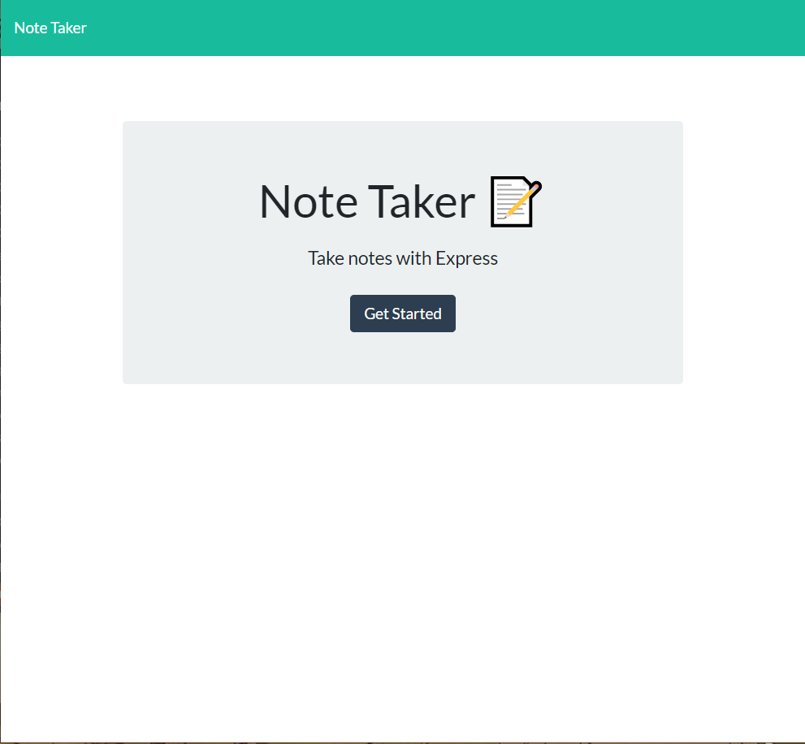

# Express-Notetaker

**This application uses Node and Express to allow users to save notes or reminders.**

**It can be accessed here -> https://notetaker-express-x.herokuapp.com/**

**To add a note simply click the pencil icon in the top right corner, type the title in one box and the content in the next then press the save button that now appears next to the pencil**

**To access saved notes click the text of the notes saved on the left hand side.**

**You can also delete any saved notes by clicking the trash can icon next to each note.**
